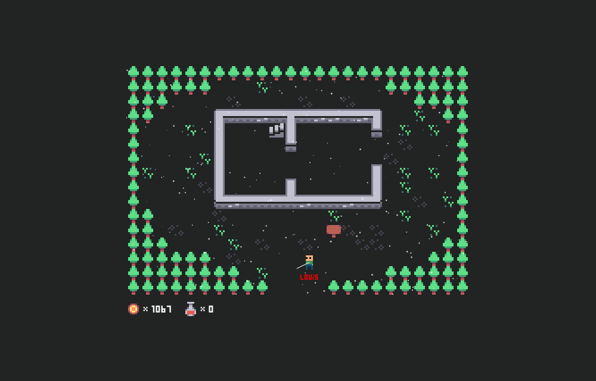

# Open-source MMO

### Chat commands

| Command                   | Description          | Admin |
|---------------------------|:--------------------:|:-----:|
| `/spawn`                  | Teleport to spawn    |       |
| `/room <room ID>`         | Teleport to room     |   👑   |
| `/room <room ID> <x> <y>` | Teleport to location |   👑   |
| `/skin <type>`            | Change player sprite |   👑   |
| `/rain`                   | Toggle rain          |       |
| `/snow`                   | Toggle snow          |       |

### Resource links

[8x8 Character and Sprite Sheet - Glacialan](https://opengameart.org/content/8x8-character-and-sprite-sheet)

[Mini Roguelike 8x8 Tiles - morgan3d](https://opengameart.org/content/mini-roguelike-8x8-tiles)

[Pixel Fonts - pix3m](https://opengameart.org/content/pixel-fonts-by-pix3m)

[16x16 Fantasy Tileset - Jerom](https://opengameart.org/content/16x16-fantasy-tileset)

[The Adventure Begins - bart](https://opengameart.org/content/adventure-begins)

[Foot walking step sounds - Jute](https://opengameart.org/content/foot-walking-step-sounds-on-stone-water-snow-wood-and-dirt)

[RogueDB32](https://opengameart.org/content/roguedb32)

[DLC for 8x8 Tileset](https://opengameart.org/content/dlc1-for-8x8px-tileset)

[Top Sci-Fi CGA Tileset](https://opengameart.org/content/top-sci-fi-cga-tileset)

[Legend of Fanguary Tileset](https://opengameart.org/content/legend-of-fangury-characters-and-tileset-8x8)

[8x8 resource pack](https://opengameart.org/content/8x8-resource-pack)